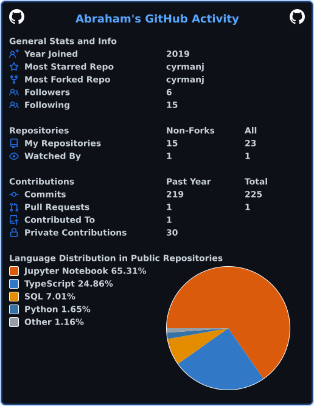

# Hi, I'm Abraham Cyrman Jiménez 👋  
**Data Analysis & Automation Specialist | Python | SQL | Power BI | Alteryx | AWS**

With 16+ years of experience in multinational and financial organizations, I specialize in **data analysis, automation, and end-to-end process improvement**. I’ve led high-impact projects across global teams (US, EMEA, Brazil, India, Germany), delivering **thousands of hours saved**, significant defect reductions, and improved operational accuracy.

I am certified in **Data Analysis (FundaTEC)** and have hands-on experience with **AWS analytics tools**, ETL optimization, and business intelligence solutions.

---

## 🔧 Technical Skills  
- **Data Analysis & ETL:** Python, SQL, Alteryx, Excel (Advanced)  
- **Business Intelligence:** Power BI, AWS QuickSight  
- **Cloud:** AWS Cloud Practitioner, AWS Data Analytics  
- **Automation:** End-to-end workflow design, dashboard automation, KPI consolidation  
- **Other:** RCA, Requirements gathering, Cross-functional collaboration  

---

## 📌 Featured Experience & Impact

### **Amazon — Payroll OE (SSA) Manager (2021–Present)**  
Leading automation initiatives across international payroll teams to drive efficiency, visibility, and process accuracy.

- Led full automation lifecycle — requirements → workflow design → validation → deployment.  
- Built an automated **EMEA Power BI dashboard** replacing 500+ hours of manual work annually.  
- Rebuilt an Alteryx ETL pipeline using CTEs → **runtime reduced from 4 hours to 30 minutes (87% faster)**.  
- Designed Power BI solutions for India Payroll → **8,000+ hours saved**, **3,600 defects eliminated**, sigma ↑ from 4.3 → 4.8.  
- Developed US Payroll dashboard integrating multiple sources → **6,300+ hours saved** annually.  
- Created Germany Payroll Alteryx workflow → **1,100 hours saved** & **$424,000 recovered** via tax-exemption identification.  
- Earned promotion (L4 → L5) for delivering **high-value automations** and improving process sigma levels (e.g., 2.6 → 3.1).

---

### **HP (2006–2020) — Business Analyst & Continuous Improvement Lead**  

**Business Analyst (2018–2020)**  
- Built a text-mining RCA model → manual review reduced by **30%**, metric improved **3%**.  
- Designed Power BI mobile tool for field technicians using CRM live data → reduced inquiries & increased operational efficiency.

**Continuous Improvement Lead (2017–2018)**  
- Managed process improvement initiatives across supply chain, customer service, and field delivery.

**Area Business Manager (2015–2017)**  
- Served as liaison for Customer Service, Supply Chain, and Field Delivery teams; improved communication, metrics, and customer satisfaction.

---

## 🎓 Education  
**Data Analysis Technical Program — Tecnológico de Costa Rica**

---

## 📄 Certifications  
- Alteryx Designer Core  
- AWS Cloud Quest: Cloud Practitioner  
- AWS Cloud Quest: Data Analytics  

---

## 🌐 Languages  
- **Spanish:** Native  
- **English:** C1  

---

## 📬 Contact  
- **Email:** cyrmanj@gmail.com  
- **LinkedIn:** https://www.linkedin.com/in/abraham-cyrmanj/  
- **CV:** [Download CV](./Abraham_Cyrman_Jimenez_CV.pdf)

---

## 📂 What You’ll Find in My GitHub  
- Data analysis projects (Python, SQL)  
- ETL workflows & automation solutions  
- Power BI dashboards  
- AWS analytics & reporting experiments  
- Portfolio of end-to-end analytics solutions

## 🚴‍♂️ Interests

- **Mountain Biking:** Disciplined training focused on consistency, performance metrics, and continuous improvement. Nerd for cycling metrics.
- **Cars & Motorcycles:** Passionate about driving, mechanical systems, and performance optimization.
- **DSLR Photography:** Enthusiast photographer of nature and/or my other interests, such as motorcycles, cars, cycling.

## 📊 Languages/Stats:

## 🔭 Profile Visitors:

Thanks for visiting my profile! 🚀
